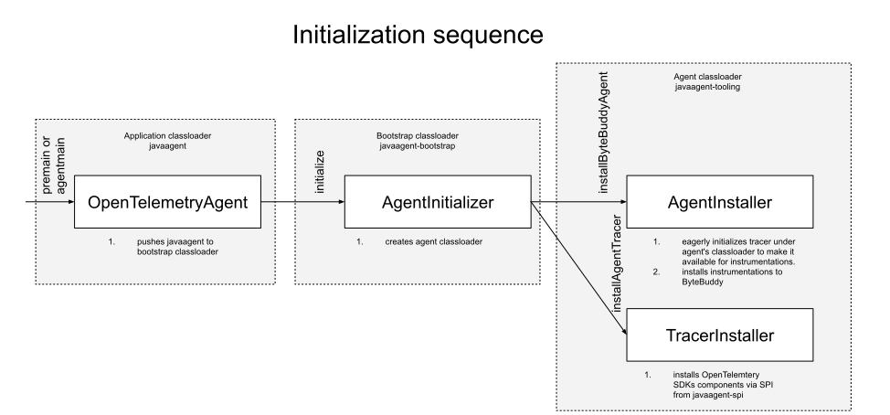
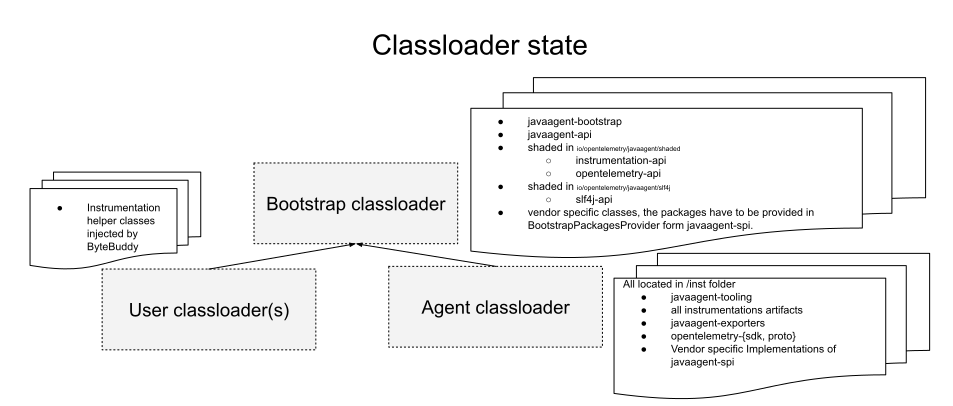

### 理解 javaagent 的组件

javaagent 的 jar 包可以在逻辑上被划分为三个部分：

- 处于 system class loader 的模块
- 处于 bootstrap class loader 的模块
- 处于 agent class loader 的模块

### 处于 system class loader 的模块

#### `javaagent` 模块

这个模块由实现了接口[Java
instrumentation agent](https://docs.oracle.com/javase/7/docs/api/java/lang/instrument/package-summary.html)
的 `io.opentelemetry.javaagent.OpenTelemetryAgent` 单个类组成。这个类在应用的启动阶段被应用的类加载器所加载。
它的唯一职责是将 agent 的类加载到 JVM 的 bootstrap classloader 上并立即委托给 `io.opentelemetry.javaagent.bootstrap.AgentInitializer`
（目前处于 bootstrap class loader）执行。

### 处于 bootstrap class loader 的模块

#### `javaagent-bootstrap` 模块

`io.opentelemetry.javaagent.bootstrap.AgentInitializer` 以及一些其他的类将会处于 bootstrap class loader 中，
但是并不会被直接自动集成。

#### `instrumentation-api` 和 `javaagent-api` 模块

这些模块包含后续要加载的实际的集成库的支持类。运行中应用的所有类加载器应该都能够访问到这些类。因此，将 `javaagent` 模块下所有的类都放到类
JVM 的 bootstrap classloader。由于对于实际应用来说，这带来了意外暴露这些类的可能性，因此这个模块的依赖应该尽可能的小。

`instrumentation-api` 包含了库代码和自动增强都需要的类，而 `javaagent-api` 只包含了自动增强所需要用到的类。

### 在 agent class loader 中的模块

#### `javaagent-tooling` 模块 和 `instrumentation` 的子模块

这部分包括所有对于让集成生效的部分，包括与 [ByteBuddy](https://bytebuddy.net/) 所做的集成和与特定库所实际集成的部分。因为这一部分的类依赖自不同的库
数量实际上是非常庞大的，因此有必要去对宿主应用去隐藏这一部分的类。这通过以下的方式实现：

- 当 `javaagent` 模块在构建最后的 agent 的时候，它将会把 `instrumentation` 子模块和 `javaagent-tooling` 模块下的所有类移动到成果物 jar 包的一个
  叫做 `inst` 的独立目录下。同时，这些类的扩展名都会从 `class` 被修改为 `classdata`来确保通常的类加载器无法找到这些类。
- 当 `io.opentelemetry.javaagent.bootstrap.AgentInitializer` 被调用的时候，将会
  创建一个 `io.opentelemetry.javaagent.instrumentation.api.AgentClassLoader` 的实例，并从 `AgentClassLoader` 加载一个
  `io.opentelemetry.javaagent.tooling.AgentInstaller` 并将控制权传递给 `AgentInstaller` （目前处于 `AgentClassLoader` 中）。
  `AgentInstaller` 将会在 ByteBuddy 的帮助下初始化所有 agent 集成。相比在 agent class loader 中来加载所有的 agent 类的做法，这里采用了在 bootstrap classloader 中
  shaded 并加载的做法。但是这会导致反序列化的安全漏洞，并额外增加了 shaded 类的调试难度。

以上复杂的过程保证自动增强的 agent 类与应用之间的彻底隔离，并且任意一个类加载器的增强类都能够从 bootstrap classloader 上访问到辅助类。

#### Agent jar 结构

如果你现在查看 `javaagent/build/libs/opentelemetry-javaagent-<version>-all.jar` 的内部，你将会发现接下来几个由类组成的"集群"：

处于 system class loader:

- `io/opentelemetry/javaagent/bootstrap/AgentBootstrap` - `javaagent` 模块中的一个类

处于 bootstrap class loader:

- `io/opentelemetry/javaagent/bootstrap/` - 包括 `javaagent-bootstrap` 模块
- `io/opentelemetry/javaagent/instrumentation/api/` - 包括 `javaagent-api` 模块
- `io/opentelemetry/javaagent/shaded/instrumentation/api/` -包括 `instrumentation-api` 模块,
  并通过 Gradle 的 Shadow 插件在 `javaagent` jar 包构造的过程中进行 shaded
- `io/opentelemetry/javaagent/shaded/io/` - 包括 OpenTelemetry 的 API 以及依赖的 gRPC 上下文，并通过 Gradle 的 Shadow 插件
  在 `javaagent` jar 包构造的过程中进行 shaded
- `io/opentelemetry/javaagent/slf4j/` - 包括跑 SLF4J 及其简单的日志实现，并通过 Gradle 的 Shadow 插件在 `javaagent` jar 包构
  造的过程中进行 shaded

处于 agent class loader:

- `inst/` - 包括 `javaagent-tooling` 模块和 `instrumentation` 子模块，被 `AgentClassLoader` 并被隔离。这里也包括 OpenTelemetry
  的 SDK，当使用 `-all` 构建的时候会包括 exporter

[Image source](https://docs.google.com/drawings/d/1FyRd11emnHvNWzUXLdpMNyf2R-auZlJsicNg8FpU_Ys)

[Image source](https://docs.google.com/drawings/d/1WlJ_VHuo_t4RurQ6_qiQHdEBgRLc22l7L5f5dFRqgB8)

